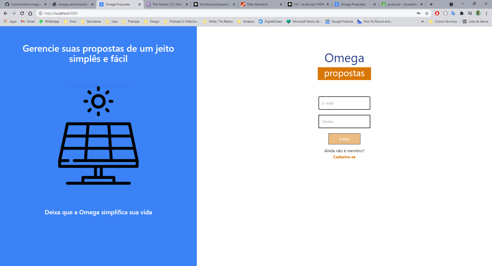
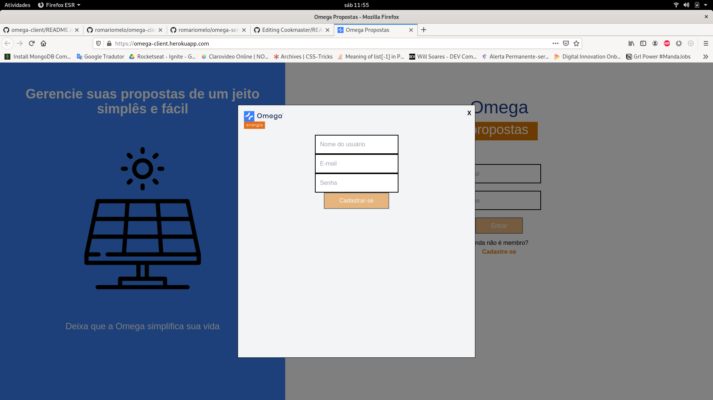
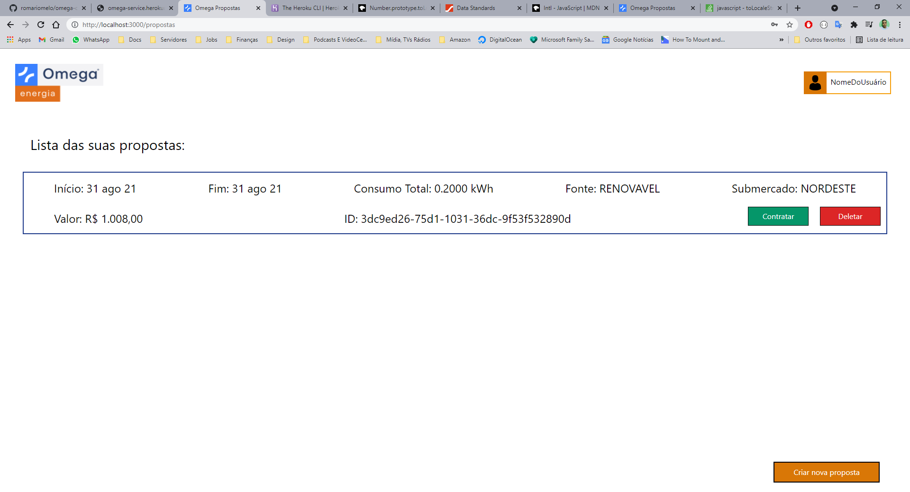
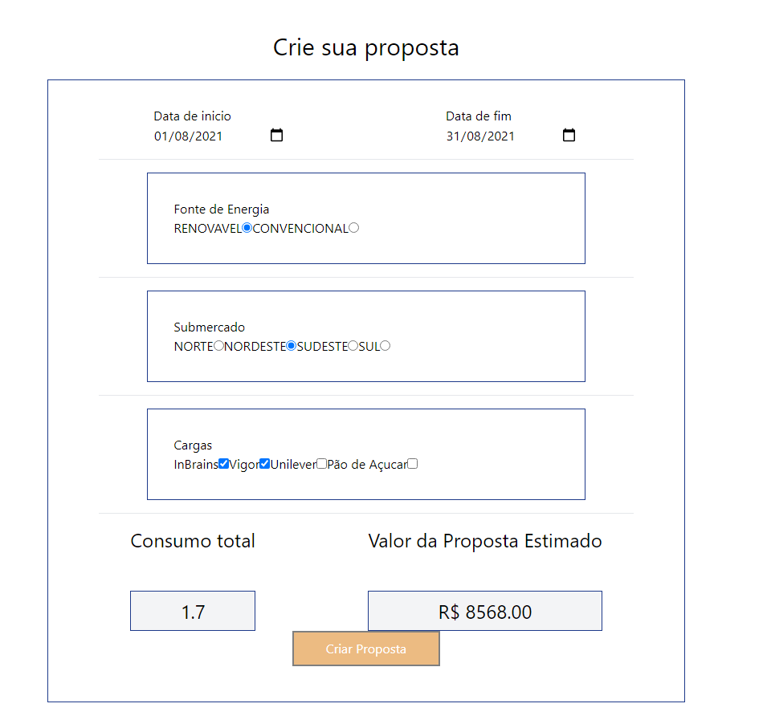

## Omega-cliente

---

Este é um desafio técnico proposto pela empresa Omega Energia especializada em geração de energia renovável.
Tem como objetivo, gerar uma aplicação de uma Calculadora de proposta para calcular a contração de energia.
Foi desenvolvido juntamente com uma [API](https://github.com/romariomelo/omega-service) que contém as rotas necessárias para alimentar este projeto.

### Como iniciar projeto

```bash
npm install
npm start

# or

yarn install
yarn start
```

Sua aplicação deve rodar no [http://localhost:3000](http://localhost:3000)!

## Desenvolvimento

---

# Requisitos do projeto

### 1 - Criar uma tela de login

- Para o usuário acessar o formulário de propostas ele deve estar autenticado
- Para se autenticar o usuário deve fornecer um email em um formato válido `email@email.com`
- Para se autenticar o usuário deve fornecer uma senha com tamanho maior ou igual a 8 caracteres
- Para se autenticar o usuário deve estar cadastrado no banco de dados
- Ao ser autenticado o usuário deve ser direcionado a página de lista de proposta

### 2 - Criar uma tela de cadastro de usuário

- O usuário deve fornecer um email em um formato válido `email@email.com`
- O usuário deve fornecer uma senha com tamanho maior ou igual a 8 caracteres
- O usuário deve fornecer um nome

### 3 - Criar uma tela de lista de proposta

- Na listagem das propostas deve mostrar as opções para contratar e excluir a proposta caso ela não esteja contratada;
- Na listagem das propostas não deve mostrar as opções contratar e excluir caso a proposta esteja contratada;

### 4 - Criar um formulário de propostas

- O formulário deve ser inicializado com todos os valores vazios por padrão e após a criação de uma nova proposta deve ser limpo;
- Os campos do formulário devem ser alimentados pela informações contidas no banco de dados e fornecida pela [API](https://github.com/romariomelo/omega-service)
- Deve ser apresentado em tempo real o valor da proposta durante o preenchimento do formulário da calculadora de proposta;

---

# Telas prontas

## Login



## Cadastro



## Listagem



## Formulário


